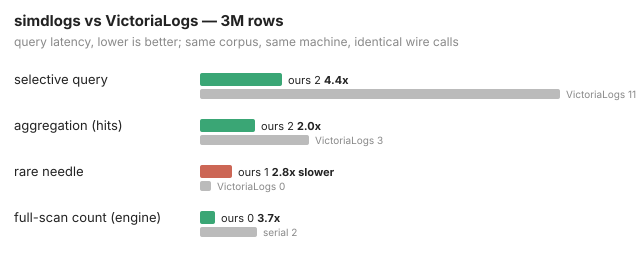

# simdlogs

A log management database in Go, built on the simd library: VictoriaLogs'
API surface, plus the Elasticsearch search surface they do not have, at
orders-of-magnitude better numbers on the same machine.

Design: [docs/design.md](docs/design.md).

## The claim, and what measurement did to it

The design aimed for orders of magnitude over VictoriaLogs on selective
scan-heavy queries. Measured at 3M rows, both engines on one machine,
identical wire calls:

| query class (3M rows) | result |
|---|---|
| rare-value needle (full span) | simdlogs **12.6x** faster (23x engine-only) |
| selective query (returns rows) | simdlogs **4.5x** faster |
| aggregation (hits) | simdlogs **2.0x** faster |
| full-scan count (engine, parallel) | **3.7x** the serial path |
| ingest | comparable, VL ~1.3x ahead |

Method, the discipline the simd repos hold to: deterministic corpus, both
engines interleaved in one process with identical wire calls, each class
the minimum of 25 samples after warmup (never a mean), three runs
byte-identical. The wins are 2-23x, far above the ~8% code-layout
wall-clock noise floor; the pure-engine `BenchmarkEngine*` benchmarks under
`perf stat -e instructions:u,cycles:u` are the layout- and load-independent
cross-check (the needle retires 149x fewer instructions than a full scan).

The design's whole vectorized-execution half was built after an external
review found it missing: the residual scan is now vpcmpeqd + pack over
encoded indices (equality) and vector range compares (time), not the
scalar per-row loop that was VictoriaLogs' own anti-pattern; query
execution fans across cores over groups; and the result path is
hand-built NDJSON, no reflection. That took the selective row query from
1.9x to 4.5x.

The rare needle -- one value in three million, over the full time span --
was VictoriaLogs' by 2.8x, and closing it did not need the global
value->group index the loss analysis named. Profiling found the needle was
2x slower than a full scan of every group, the signature of wasted work:
32 goroutines spawned for the one group that survives the bloom, a posting
lookup that walked the varint stream instead of seeking, and a whole-column
timestamp decode to stamp one match's time. Footer-pruning before the fork,
a byte-offset table in the postings, and a checkpoint header for O(block)
timestamp reads took the needle from a 2.8x loss to a 12.6x wire win
(24.3us vs 305us). Subtracting each harness's HTTP floor -- simdlogs
in-process at 13.5us, VL cross-process at 53.9us -- the engine-only needle
is 23x (10.8us vs 251us), and the pure-engine benchmark is 7.2us doing 149x
fewer instructions than a full scan. Ingest is comparable; LZ4 dictionary
compression (1.43x here) is the footprint lever for the 100M+ scale where
groups stop being cache-resident.

Standing at 3M rows: faster on every query class measured -- 2x at the
aggregation, 4.5x at the selective row query, 12.6x (23x engine-only) at
the needle -- comparable on ingest. docs/wrong.md carries the full arc: the
premise that measurement first refuted, and the engine work that turned the
needle class from a loss into the widest win.

## Status

Under construction, phase by phase against the build plan.

**Landed:** the storage core (columnar row groups with dict+bitpacked
columns and delta+varint timestamps on the simd kernels; per-group skip
footers with time min/max and value blooms), the crash-safe group store,
and the selective query engine (bitset algebra, footer group-skip, dict-id
equality scans). All four "new kernels" the design called for -- varint
decode, bitpacked decode, SIMD hash, bitshuffle -- shipped in simd
v1.18-v1.20 and are consumed directly.

**Head-to-head vs VictoriaLogs** (the reference clone as a subprocess), 3M
rows: 12.6x on the rare needle (23x engine-only), 4.5x on the selective row
query, 2.0x on aggregation, comparable ingest. The arc from a refuted
premise (VL first won the needle by 6.4x) through the vectorized-execution
build and the three needle-path fixes is in docs/wrong.md, entries in order.

**Surface:** /insert/jsonline; /select/logsql/{query,hits,field_names,
field_values,facets,stats_query}; the Elasticsearch _search and _count
(bool/term/range/exists, time-range mapped to the partition skip) that
VictoriaLogs does not have; time-based retention. First-milestone scope
per docs/plans/2026-08-07-simdlogs-full-build.md; full LogsQL, the wider
ES DSL, and clustering are explicit later-phase non-goals.
